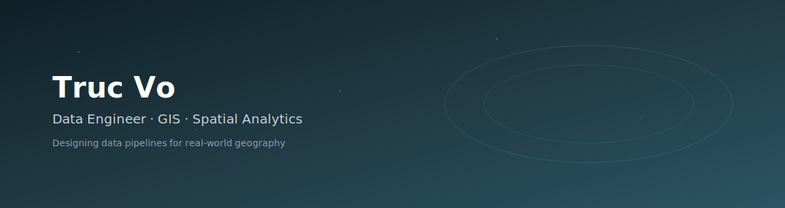

  

## Hi, I'm Truc Vo

Data Engineer specializing in large-scale data pipelines, geospatial analytics, and backend systems.
I design and operate data infrastructure where accuracy, performance, and traceability are non-negotiable.

My work focuses on turning raw, fragmented spatial data into reliable analytical assets used for
decision-making, monitoring, and planning.

---

## Core Expertise

**Data Engineering**
- Designing ETL pipelines for high-volume and heterogeneous data sources
- Data cleaning, normalization, validation, and enrichment
- Query optimization for analytical workloads

**Geospatial & GIS**
- Spatial data modeling with PostGIS
- GeoJSON, WKT/WKB, coordinate systems, projections
- GIS analysis workflows for urban and location-based datasets

**Backend & Integration**
- RESTful API integration
- Web scraping and data extraction at scale
- Systematic handling of unreliable or undocumented data sources

---

## Technology Stack

**Languages**
- Python, SQL, Bash

**Databases**
- PostgreSQL, SQL Server
- Analytical query optimization

**Data & Analytics**
- Power Bi
- Airflow, Dasgter
- Pandas, Shapely, GDAL

**GIS Tools**
- ArcGIS
- Spatial indexing and geometry processing

**Infrastructure**
- Docker
- Linux-based environments

---

## Selected Projects

### Web GIS Data Platform
- Backend system for managing and visualizing spatial datasets
- Optimized PostGIS queries for map-based analytics
- Designed for scalability and long-term maintainability

### Large-Scale Data Integration Pipelines
- ETL pipelines ingesting data from APIs, web portals, and semi-structured sources
- Robust handling of encoding issues, missing fields, and inconsistent schemas
- Focus on data quality over superficial speed

---

## Engineering Principles

- Data pipelines should be explainable, not mysterious
- Performance problems are design problems
- Spatial data deserves the same engineering discipline as any other system
- Clean data beats clever hacks every time

---

## GitHub Activity

  

  

---

## Contact

- GitHub: https://github.com/vhctruc
- Email: your-email@example.com
